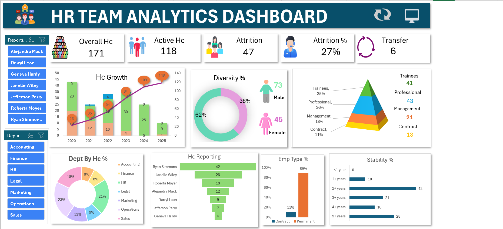

# HR Team Analytics Dashboard

### 1. Project Title / Headline
An interactive excel based HR analytics dashboard built to
analyze employee headcount, attrition, growth trends, diversity,
job levels, reporting structure, and workforce stability.

### 2. Short Description / Purpose
The HR Team Analytics Dashboard provides a clear view of
171 total headcount across active, attrition, and transfer status.

It helps analyze

total headcount

active headcount

attrition rate

gender diversity %

job level distribution (Trainee, Professional, Management, Contract)

headcount growth and stability trends across departments.

### 3. Tech Stack
Microsoft Excel

Power Query – Data cleaning and transformation

Excel Formulas – Calculations and KPIs

Pivot Tables & Pivot Charts – Data analysis

Slicers – Interactive filtering (Reporting Manager & Department)

Dashboard Design & Data Visualization

### 4. Data Set
The project uses an HR workforce dataset
containing records of 171 employees across multiple departments and tenure periods.

Key columns include:

Reporting Manager

Department (Accounting, Finance, HR, Legal, Marketing, Operations, Sales)

Active Status (Active, Attrition, Transfer)

Gender (Male, Female)

Job Level (Trainee, Professional, Management, Contract)

Employment Type (Permanent, Contract)

Tenure / Stability Years (<1 year to 5+ years)

Year of Joining / Growth Period (2020 to 2025)

### 5. Features / Highlights

• Business Problem
In dynamic corporate environments, HR leaders and department heads struggle to monitor employee turnover, gender diversity ratios, reporting manager spans, and tenure stability directly from scattered personnel files.

Key questions such as:
- Which departments and job levels experience the highest attrition rate?
- What is the current gender diversity balance across the organization?
- How is headcount scaling year-over-year, and which reporting managers oversee the largest teams?
...are difficult to answer quickly without unified interactive analytics.

• Goal of the Dashboard
To deliver an interactive visual tool that:
- Tracks key HR performance indicators (Overall Headcount, Active Headcount, Attrition %, Transfers)
- Uncovers workforce diversity, job level pyramids, and employment type breakdowns
- Supports HR decision-making in talent retention, leadership workload distribution, and recruitment planning.

• Walkthrough of Key Visuals
- Key KPIs
  - Overall Hc: 171
  - Active Hc: 118
  - Attrition: 47
  - Attrition %: 27%
  - Transfer: 6
- Filter Panel
  Interactive slicers enable filtering across Reporting Managers (e.g., Ryan Simmons, Janelle Wiley) and Departments (e.g., Marketing, HR, Sales).
- Diversity % (Donut Chart)
  Displays gender distribution: Male accounts for 62% (73 employees), while Female accounts for 38% (45 employees).
- Job Role Pyramid (Pyramid Chart)
  Displays role hierarchy: Professional (36% / 43), Trainees (35% / 41), Management (18% / 21), and Contract (11% / 13).
- Hc Growth (Line & Bar Stacked Chart)
  Tracks headcount trajectory from 2020 (20 active) up to 2025 (118 active), showing steady workforce expansion.
- Dept By Hc % (Donut Chart)
  Highlights departmental headcount distribution led by Marketing (23%), HR (21%), Sales (18%), Operations (13%), Legal (9%), Finance (8%), and Accounting (8%).
- Hc Reporting (Horizontal Bar Chart)
  Ranks top reporting managers by team size: Ryan Simmons (42), Janelle Wiley (26), Roberta Moyer (18), Alejandra Mack (12), Darryl Leon (9), Jefferson Perry (7), and Geneva Hardy (4).
- Emp Type % (Column Chart)
  Shows employment structure: Permanent employees make up 89%, while Contract employees represent 11%.
- Stability % (Horizontal Bar Chart)
  Illustrates employee tenure distribution: 2+ years is the largest group (42 employees), followed by 5+ years (28), 3+ years (21), 4+ years (16), and 1+ years (10).

### 6. Screenshots

